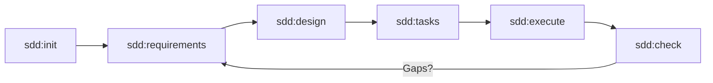

# Spec-Driven Development (SDD) Extension for Gemini CLI

[](https://opensource.org/licenses/Apache-2.0)
[](https://github.com/google/gemini-cli)

Automate a high-rigor, professional **Spec-Driven Development** workflow. This extension transforms Gemini CLI from a coding assistant into a disciplined virtual engineering team that ensures every line of code is grounded in a clear requirement and a validated design.

---

## 👥 Meet Your Virtual Engineering Team

This extension leverages specialized AI personas to guide you through each phase of the development lifecycle:

*   **🚩 Product Owner** (`/sdd:requirements`): Uncovers the "Why" and "Who." Focuses on business value and preventing scope creep.
*   **📐 Systems Architect** (`/sdd:design`): Maps the "How." Generates Mermaid visuals and manages architectural debt.
*   **📋 Scrum Master** (`/sdd:tasks`): Plans the "When." Enforces a "Definition of Ready" and identifies technical risks.
*   **💻 Senior Engineer** (`/sdd:execute`): Handles the "Do." Implements code as a "Local Native," adhering to your project's `GEMINI.md`.
*   **⚖️ Compliance Auditor** (`/sdd:check`): Ensures the "Golden Thread." Verifies traceability from requirement to code.

---

## 🔄 The SDD Lifecycle



---

## 🚀 Quick Start

### Installation

Install the extension directly from the repository:

```bash
gemini extensions install https://github.com/jlmonteiro/gemini-cli-sdd-extension
```

> **Note:** You will need to restart your Gemini CLI session after installation for the new `/sdd` commands to be available.

### Your First 5 Minutes

1.  **Initialize your project:**
    Run `/sdd:init` in any directory. If you have existing code, the Architect will retroactively map it!
2.  **Define a new feature:**
    Run `/sdd:requirements` and describe your goal (e.g., "Add a JWT auth layer").
3.  **Architect the solution:**
    Run `/sdd:design`. The Architect will propose a solution and BDD test scenarios.
4.  **Execute the work:**
    Run `/sdd:tasks` to create a plan, then `/sdd:execute` to watch the code being built story-by-story.

---

## 📖 Documentation

For detailed guides on architectural personas, tool guardrails, and advanced configuration, see the [Full Documentation](https://github.com/jlmonteiro/gemini-cli-sdd-extension/blob/main/docs/index.md).

## ⚖️ License

Licensed under the Apache License, Version 2.0. See [LICENSE](./LICENSE) for details.
