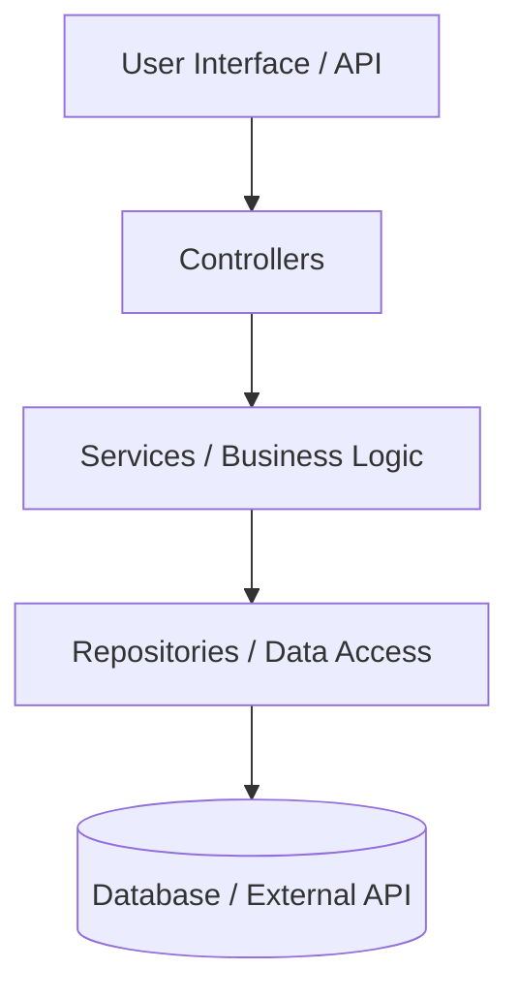

# Design: [Project Name]

## 1. Implementation Strategy
High-level approach to solving the requirements defined in `requirements.md`.

## 2. Component Design
Describe key components, their responsibilities, and interactions.

### Component Layer Diagram
Include a Mermaid diagram (e.g., `graph TD` or `sequenceDiagram`) showing the interaction between the system's layers (e.g., Controllers > Services > Repositories > Database).

## 3. Configuration & Environment
- **Configuration Files:** List primary configuration files (e.g., `application.yaml`, `settings.json`, `.env.example`).
- **Environment Variables:** Document required environment variables and their purpose.
- **Secrets Management:** Describe how sensitive information (API keys, passwords) is handled.

## 4. External Dependencies
- **Libraries/Frameworks:** List major third-party libraries and rationalize their usage.
- **APIs/Services:** External services or internal microservices.
- **Infrastructure:** Databases, caches, or cloud providers.

## 5. Data Model / State Management
Details on data structures, schema, or state flow.

## 6. Security & Performance
Design-level considerations for meeting non-functional requirements.
